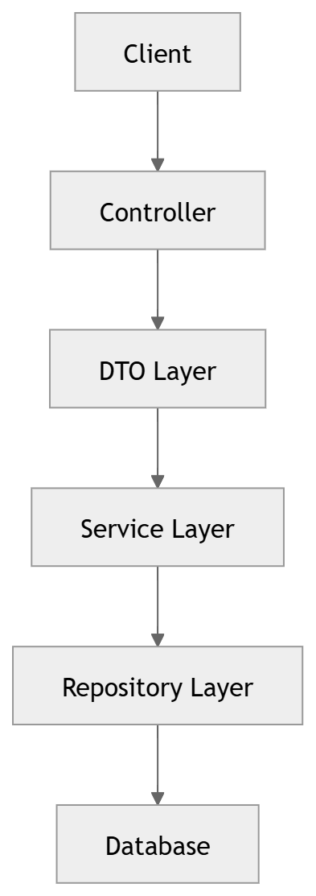

# bank-management-system

Built using Spring Boot to simulate real-world banking operations 
such as managing customers, accounts, and financial transactions.
The system follows clean architecture principles and demonstrates 
key concepts including layered design, DTO usage, transaction 
handling, exception management, and JWT-based security.

---

## Tech Stack

- Java 17
- Spring Boot
- Spring Security
- JWT (JSON Web Tokens) - jjwt 0.12.6
- Spring Data JPA
- MySQL
- Hibernate
- Lombok
- Exception Handling
- Maven
- Jakarta Validation

---

## Architecture & Design

The project follows a **layered architecture** that ensures 
maintainable, clean code.

#### Flow Diagram:

#### Layers Explained:
- **Controller Layer** – Handles HTTP requests and responses.
- **DTO Layer** – Transfers data between client and server.
- **Service Layer** – Contains business logic such as transactions,
  deposits, withdrawals, and transfers.
- **Repository Layer** – Interacts with the database using Spring Data JPA.
- **Entity Layer** – Represents database tables and relationships.
- **Security Layer** – Handles authentication and authorization
  using Spring Security and JWT tokens.

---

## Security

The system uses **JWT (JSON Web Token)** based authentication.

#### How it works:
1. User registers via `POST /api/auth/register`
2. User logs in via `POST /api/auth/login` → receives JWT token
3. Token must be sent in every protected request:
   `Authorization: Bearer <token>`
4. Token expires after 15 minutes

#### Access Levels:
- **Public** – Register and Login endpoints
- **Authenticated** – Any logged-in user
- **Admin Only** – Get all accounts, Update account status

---

## Setup

1. Clone the repository
2. Copy `src/main/resources/application.properties.example`
   to `src/main/resources/application.properties`
3. Fill in your database credentials and JWT secret
4. Create MySQL database named `bankdb`
5. Run the application

---

## Features

#### Authentication
- Register new user
- Login and receive JWT token

#### Customer Management
- Create customer
- Retrieve customer by ID

#### Account Management
- Create account
- Retrieve account by ID (includes transaction history)
- Get all accounts (Admin only)
- Update account status — ACTIVE / SUSPENDED (Admin only)

#### Transaction Management
- Deposit money
- Withdraw money
- Transfer money between accounts

#### Exceptions Handled
- Prevent insufficient balance withdrawals
- Prevent transfers to the same account
- Validate transaction amounts
- Handle unauthorized access (401)
- Handle forbidden access (403)

---

## API Endpoints

#### Authentication (Public)
- `POST /api/auth/register` – Register new user
- `POST /api/auth/login` – Login and get JWT token

#### Customers (Authenticated)
- `POST /api/customers` – Create customer
- `GET /api/customers/{id}` – Get customer by ID

#### Accounts
- `POST /api/accounts` – Create account (Authenticated)
- `GET /api/accounts/{id}` – Get account by ID (Authenticated)
- `GET /api/accounts` – Get all accounts (Admin only)
- `PATCH /api/accounts/{id}/status` – Update status (Admin only)

#### Transactions (Authenticated)
- `POST /api/transactions/deposit` – Deposit money
- `POST /api/transactions/withdraw` – Withdraw money
- `POST /api/transactions/transfer` – Transfer money

---

## Key Concepts

- Layered Architecture (Controller → DTO → Service → Repository → Database)
- DTO Pattern (Request & Response separation)
- RESTful API Design
- JPA Relationships (OneToMany / ManyToOne)
- Transaction Handling (@Transactional)
- Enum Usage for states
- Exception Handling
- JWT Authentication & Authorization
- BCrypt Password Encryption
- Stateless Session Management
- Role-Based Access Control (RBAC)
- Clean Code Principles

---

## Database Design

#### Tables
- `customers`
- `accounts`
- `transactions`
- `app_users` ← NEW (stores login credentials)

#### Relationships:
- One Customer → Many Accounts
- One Account → Many Transactions (as sender & receiver)

#### Transaction Table Columns:
- `source_account_id`
- `target_account_id`
- `amount`
- `transaction_type`
- `time_stamp`

#### App Users Table Columns:
- `id`
- `username`
- `password` (BCrypt encrypted)
- `role` (ROLE_USER / ROLE_ADMIN)
